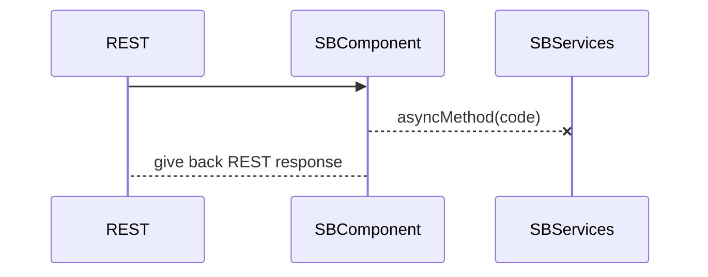
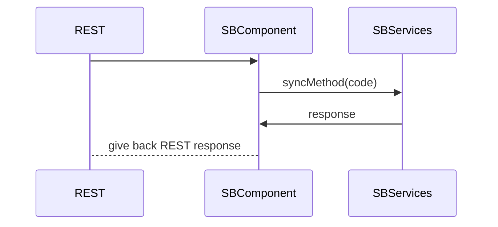

# Spring Boot - REST API with async processing data

This project has two endpoints:

 - **/async/entity/{code}** : An asynchronous handling of a longrunner process is simulated.

 - **/sync/entity/{code}** : A synchronous handling of a longrunner process is simulated.

## Run project

Run this from root folder:
`mvn spring-boot:run`

After bootstrap invoke REST operation via [browser](http://localhost:8080/swagger-ui.html).