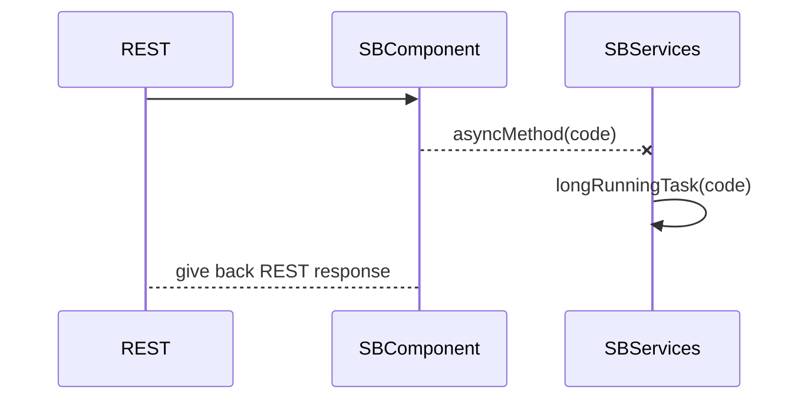
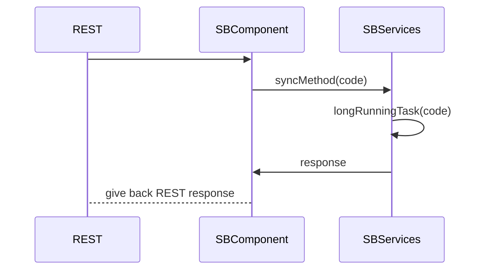

# Spring Boot - REST API with async processing data

This project has two endpoints:

 - **/async/entity/{code}** : An asynchronous handling of a longrunner process is simulated.

[Mermaid Sequence Diagram](https://mermaidjs.github.io/mermaid-live-editor/#/view/eyJjb2RlIjoic2VxdWVuY2VEaWFncmFtXG5SRVNULT4-U0JDb21wb25lbnQ6IFxuU0JDb21wb25lbnQtLVhTQlNlcnZpY2VzOiBhc3luY01ldGhvZChjb2RlKVxuU0JTZXJ2aWNlcy0-PlNCU2VydmljZXM6IGxvbmdSdW5uaW5nVGFzayhjb2RlKVxuU0JDb21wb25lbnQtLT5SRVNUOiBnaXZlIGJhY2sgUkVTVCByZXNwb25zZSIsIm1lcm1haWQiOnsidGhlbWUiOiJkZWZhdWx0In19)

 - **/sync/entity/{code}** : A synchronous handling of a longrunner process is simulated.

[Mermaid Sequence Diagram](https://mermaidjs.github.io/mermaid-live-editor/#/view/eyJjb2RlIjoic2VxdWVuY2VEaWFncmFtXG5SRVNULT4-U0JDb21wb25lbnQ6IFxuU0JDb21wb25lbnQtPj5TQlNlcnZpY2VzOiBzeW5jTWV0aG9kKGNvZGUpXG5TQlNlcnZpY2VzLT4-U0JTZXJ2aWNlczogbG9uZ1J1bm5pbmdUYXNrKGNvZGUpXG5TQlNlcnZpY2VzLT4-U0JDb21wb25lbnQ6IHJlc3BvbnNlXG5TQkNvbXBvbmVudC0tPlJFU1Q6IGdpdmUgYmFjayBSRVNUIHJlc3BvbnNlIiwibWVybWFpZCI6eyJ0aGVtZSI6ImRlZmF1bHQifX0)

## Run project

Run this from root folder:
`mvn spring-boot:run`

After bootstrap invoke REST operation via [browser](http://localhost:8080/swagger-ui.html).
